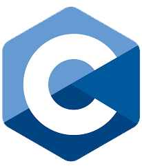

# Hello 👋

My name is Sumer Punjabi. I currently live in Ontario, Canada.

- 🎓 Studying Computer Science at University of Windsor
- 🌐 Visit my [website and portfolio](https://www.sumerpunjabi.tech/)
- Visit my socials below!

 
 

]

# Languages

  
  
  
  
  
   

# Tools & Frameworks

  
  
  
  
  
  

